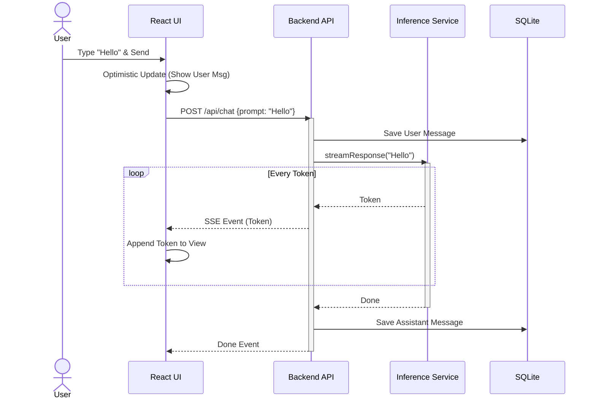
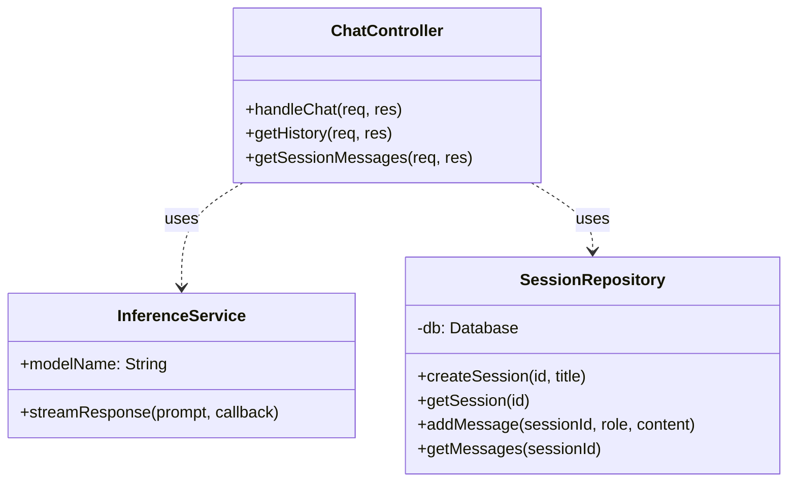

# Deliverable 1: Prescriptive Architecture

## 1. Architectural Design & Rationale

### Selected Architecture: React SPA + Node.js Backend
We have selected a **Layered Architecture** with a **Client-Server** separation, specifically using a **React Single Page Application (SPA)** for the frontend and a **Node.js (Express)** application for the backend.

**Rationale:**
1.  **User Experience (UX):** The core requirement of an LLM portal is a highly interactive, streaming chat interface. A React SPA allows for seamless state management (chat history, active session) and real-time updates (token streaming) without full page reloads, providing a "native app" feel.
2.  **Offline Capability:** The architecture explicitly includes a **Service Worker** and **IndexedDB** on the client. This enables the "Offline-First" requirement, allowing users to view past chats and potentially queue new messages even without a network connection.
3.  **Modularity:** The backend is structured into distinct layers:
    *   **Controller Layer:** Handles HTTP requests and routing.
    *   **Service Layer:** Encapsulates business logic (Inference, Session Management).
    *   **Repository Layer:** Manages data persistence (SQLite).
    This separation ensures maintainability and allows individual components (like the Inference Engine) to be swapped or upgraded without affecting the rest of the system.
4.  **Constraints Compliance:** The system is designed to run on limited resources (4 vCPU, 16GB RAM). By offloading UI rendering to the client and using a lightweight SQLite database, we maximize the resources available for the CPU-bound inference task.

### Capability Subset
For this implementation, we focus on the core "Pocket" capabilities:
*   **Text Generation:** CPU-based inference for chat.
*   **Session Management:** Create, read, and delete chat sessions.
*   **Streaming:** Real-time token delivery via Server-Sent Events (SSE).
*   **Persistence:** Local storage of chat history.

## 2. UML Diagrams

### Component Diagram
This diagram shows the high-level structural components and their interactions.

```mermaid
componentDiagram
    package "Client Workstation" {
        component "React SPA" as SPA {
            [Chat Interface]
            [Sidebar]
            [Auth Context]
        }
        component "Browser Storage" as Storage {
            [IndexedDB]
            [LocalStorage]
        }
    }

    package "Server (Node.js)" {
        component "API Gateway / Express App" as API
        component "Chat Controller" as ChatCtrl
        component "Inference Service" as InfSvc
        component "Session Repository" as Repo
        database "SQLite DB" as DB
    }

    SPA --> API : HTTPS / JSON
    SPA --> Storage : Read/Write
    API --> ChatCtrl : Route
    ChatCtrl --> InfSvc : Stream Request
    ChatCtrl --> Repo : Save Message
    Repo --> DB : SQL
```

### Sequence Diagram: Chat Flow
This diagram illustrates the flow of a user sending a message and receiving a streamed response.



### Class Diagram (Backend)
This diagram details the internal structure of the backend application.


