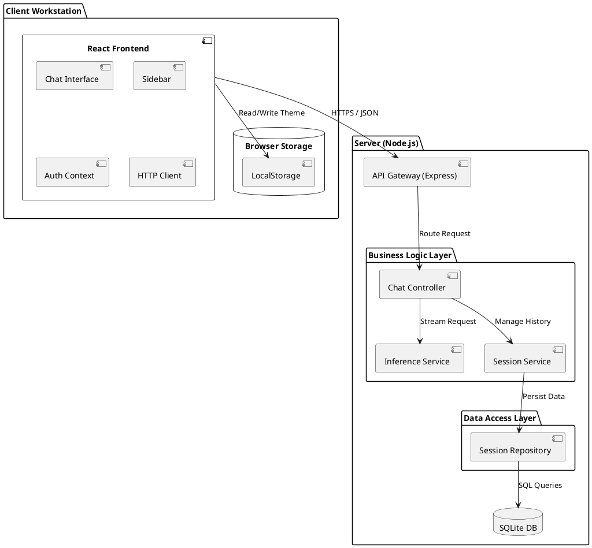
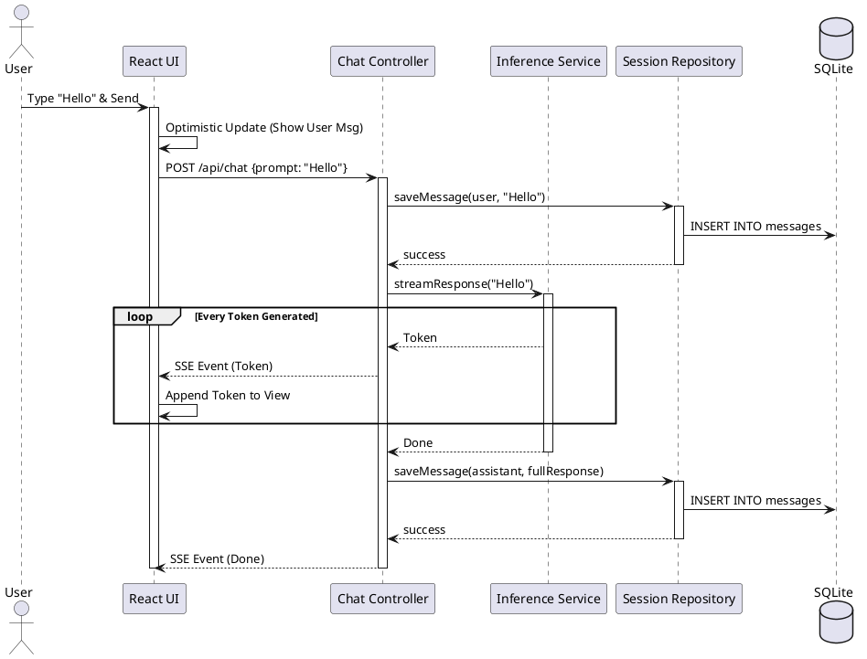
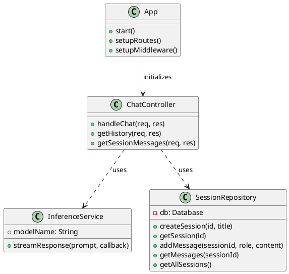
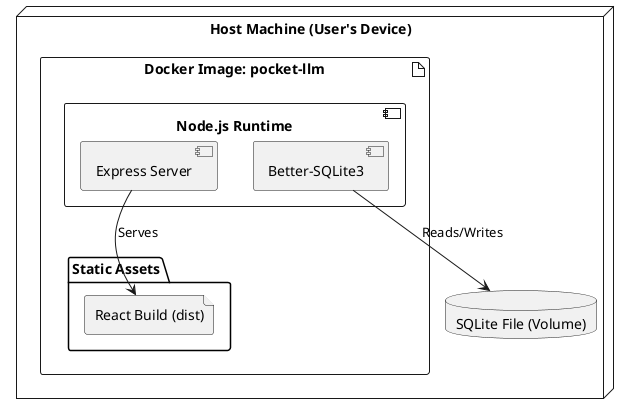
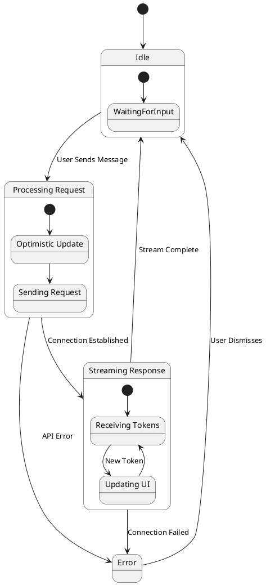
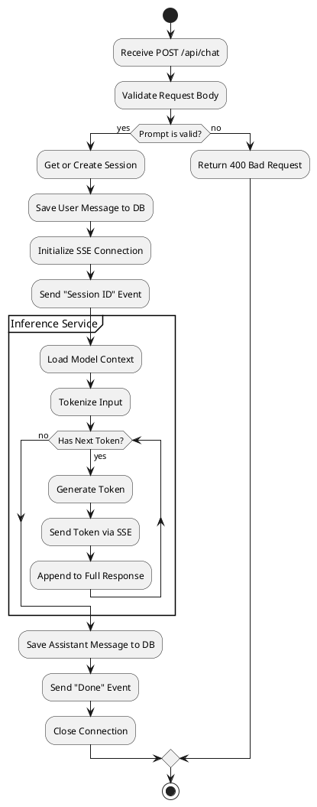

# Deliverable 1: Prescriptive Architecture

## 1. Architectural Design & Rationale

### Selected Architecture: React SPA + Node.js Backend (Layered Client-Server)
We have selected a **Layered Architecture** with a **Client-Server** separation. This architecture is "Prescriptive" because it was defined before implementation based on the project requirements and best practices for modern web applications.

**Rationale for Selection:**
1.  **User Experience (UX):** The core requirement of an LLM portal is a highly interactive, streaming chat interface. A React Single Page Application (SPA) allows for seamless state management (chat history, active session) and real-time updates (token streaming) without full page reloads. This provides a "native app" feel that is superior to traditional server-side rendered (SSR) apps for this specific use case.
2.  **Offline Capability:** The architecture explicitly supports the "Offline-First" requirement. By separating the frontend, we can leverage Service Workers and client-side storage (IndexedDB/LocalStorage) to cache the UI shell and chat history, allowing the app to function (read-only or queued) without a network connection.
3.  **Modularity & Separation of Concerns:** The backend is structured into distinct layers:
    *   **Controller Layer:** Handles HTTP requests, routing, and input validation.
    *   **Service Layer:** Encapsulates business logic (Inference, Session Management).
    *   **Repository Layer:** Manages data persistence (SQLite).
    This separation ensures maintainability and allows individual components (like the Inference Engine) to be swapped or upgraded without affecting the rest of the system.
4.  **Resource Constraints:** The system is designed to run on limited resources (4 vCPU, 16GB RAM). By offloading UI rendering to the client and using a lightweight, in-process SQLite database, we maximize the resources available for the CPU-bound inference task.

### 2. Scope of Implementation (Meaningful Subset)
We have defined the following "Meaningful Subset" of capabilities for this implementation, focusing on the core value proposition of a "Pocket" LLM:

*   **Core Chat Interface (MVP):** A fully functional, responsive chat UI that mimics premium tools (like ChatGPT) but is optimized for local execution.
*   **Streaming Inference:** Real-time token generation is critical for UX. We implemented a full Server-Sent Events (SSE) pipeline to demonstrate this.
*   **Local Persistence (Offline-First):** Instead of cloud sync, we implemented robust local storage (SQLite) for sessions and messages. This proves the "Offline" capability.
*   **Session Management:** The ability to manage multiple conversation threads is essential for a usable tool, so we included full Create/Read/List support.

**Excluded Capabilities:**
*   **User Authentication:** Not needed for a local, single-user "Pocket" app.
*   **Multi-modal Support:** Out of scope for the initial "Text-to-Text" focus.
*   **Advanced Admin Dashboard:** We focused on the user-facing chat experience as the primary deliverable.

### 3. Did we update the architecture?
**Yes, slightly.**
*   **Original Plan:** We considered a strictly "MVC" pattern where the backend might render views (e.g., EJS/Pug).
*   **Updated Decision:** We moved to a **REST API + SPA** model.
*   **Why:** The requirement for *streaming* tokens (Server-Sent Events) and complex client-side state (typing indicators, optimistic UI updates, history management) is significantly easier to implement and maintain in a React SPA than in a server-rendered view. This decoupling also allows the backend to serve other clients (e.g., a CLI or mobile app) in the future without changes.

## 2. UML Diagrams (PlantUML)

### Component Diagram
This diagram shows the high-level structural components and their interactions.

### Sequence Diagram: Chat Flow
This diagram illustrates the flow of a user sending a message and receiving a streamed response.

### Class Diagram (Backend Structure)
This diagram details the internal structure of the backend application.

### Deployment Diagram
This diagram illustrates how the application is deployed using Docker containers on the host machine.

### State Diagram: Chat Session
This diagram models the states of the chat interface during a user interaction.

### Activity Diagram: Inference Flow
This diagram details the logic flow within the backend during an inference request.

