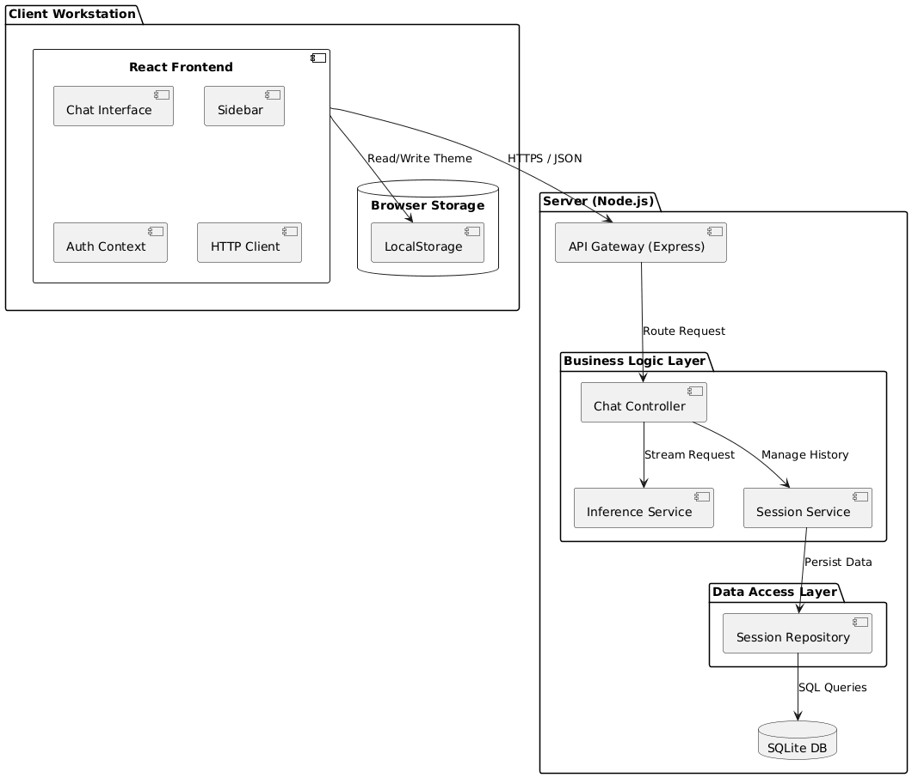
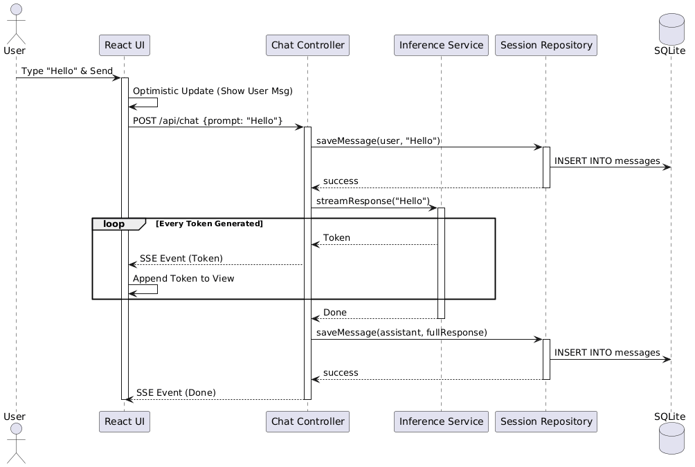
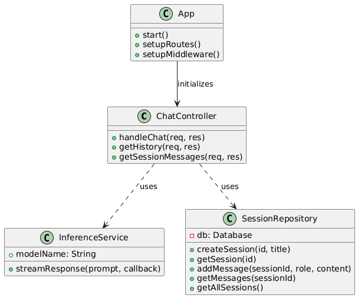
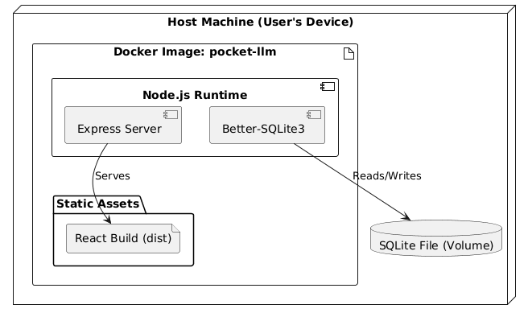
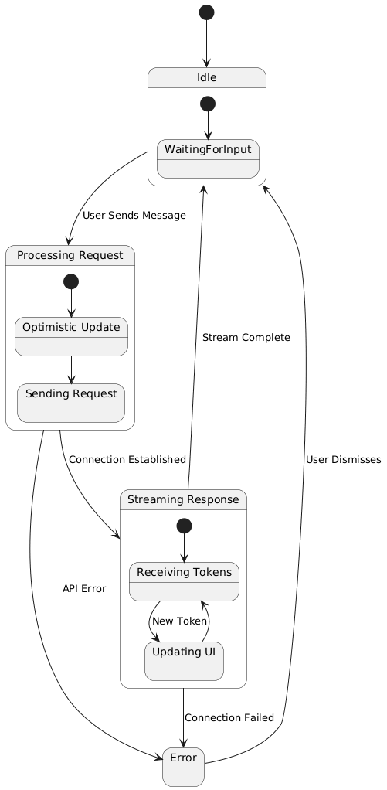

# Architecture Comparison & Selection

This document compares the architectural proposals from the team members from assignments 2 and 3 for the Pocket LLM project. The goal here is to select the best architecture that aligns with the project requirements and constraints. 

For consistency, each architecture is referenced as:
*   Architecture 1 — Aarush Verulkar

*   Architecture 2 — Sarthak Harshe

*   Architecture 3 — Mayur Prasanna

*   Architecture 4 — Ashwath Subash

*   Architecture 5 — Kasyap Sai Chakkirala

*   Architecture 6 — Sohan Walawalkar

## Architecture 1
### Brief Overview: 

React frontend paired with a simple modular backend that uses controller-style handlers to manage API interactions and maintain a clean separation between the UI and server logic.

### Pros:
*   Clear separation between frontend and backend
*   Straightforward structure that is easy to understand and implement

### Cons:
*   Backend description lacks architectural depth
*   Limited detail about how components or layers interact internally
<!-- *   **Frontend:** React.
*   **Backend:** Modular backend based on Assignment 2 structure.
*   **Pros:** Good alignment with React requirement. Clear separation of concerns.
*   **Cons:** Backend details are slightly generic, relying heavily on the previous assignment's structure without explicit Node.js/NestJS mapping details in the text provided. -->

## Architecture 2
### Brief Overview

Detailed React architecture including components, contexts, and hooks, paired with a backend structured around service and adapter layers.

### Pros:
*   Very complete and well-organized design
*   Good separation of UI logic, state management, and server communication
*   Includes admin and developer views

### Cons:
*   No significant drawbacks compared to others
<!-- *   **Frontend:** React (Detailed Component/Context/Hook breakdown).
*   **Backend:** Modular backend with explicit Service/Adapter layers.
*   **Pros:**
    *   **High Detail:** Explicitly defines React components (`ChatPage`, `HistoryPage`), Contexts (`AuthContext`), and Hooks (`useChatStream`).
    *   **Alignment:** Perfectly aligns with the "Refined" requirements for Assignment 3.
    *   **Clarity:** Clear separation of UI, State, and Side-effects (API Clients).
    *   **Completeness:** Addresses all functional requirements including Admin/Developer consoles and Batch processing.
*   **Cons:** None significant. -->

## Architecture 3
### Brief Overview

React-based architecture with strong emphasis on functional and non-functional requirements, UI behavior, caching, admin tools, telemetry, and a defined inference pipeline.

### Pros:
*   Thorough explanation of requirement deltas and system behavior
*   Clear mapping of UI states

### Cons
*   Backend architecture is not deeply detailed
*   Focus leans more toward requirements than structural design
<!-- *   **Frontend:** React.
*   **Backend:** "Stays nearly the same as HW2".
*   **Pros:** Very detailed breakdown of "Delta Functional Requirements" and UI states.
*   **Cons:** Less architectural detail on the backend structure compared to Sarthak's. Focuses more on requirements definition than architectural component mapping. -->

## Architecture 4
### Brief Overview

Django-based architecture using Django Models, Views, ViewSets, Middleware, and service functions, organized around Django’s request lifecycle.

### Pros:
*   Django offers helpful built-in components
*   Clean explanation of data flow and processing stages

### Cons
*   Integration with the frontend is not described in depth
*   Some architectural sections focus more on Django’s internal conventions rather than system-level interactions across frontend, backend, and model inference.
<!-- *   **Framework:** Django (Python).
*   **Verdict:** **REJECTED**.
*   **Reason:** The project requirements explicitly state the backend must be a **Node.js application**. This proposal uses Django, which violates the core technology constraint. -->

## Architecture 5
### Brief Overview

React (TypeScript) architecture focusing on UI customization, typing indicators, and smooth chat interactions, combined with a backend intended to support streaming and admin tools.

### Pros:
*   Strong attention to user experience and responsiveness
*   Mentions streaming behavior using `ReadableStream`
*   Includes admin dashboard concepts

### Cons
*   Backend layering details are limited
*   Focus is more on requirements than architectural structure
<!-- *   **Frontend:** React (TypeScript).
*   **Backend:** Node.js.
*   **Pros:**
    *   Good functional breakdown (Theme customization, Typing indicators).
    *   Mentions `ReadableStream` for streaming.
    *   Clear requirements for Admin Dashboard.
*   **Cons:**
    *   Less detailed on the specific backend component structure (Controllers/Services) compared to Sarthak's.
    *   Focuses heavily on requirements rather than architectural component mapping. -->

## Architecture 6
### Brief Overview

React SPA with a backend using controller–service–repository layering, two-level caching, telemetry support, offline functionality via Service Worker + IndexedDB, and a pluggable CPU-only model runner.

### Pros:
*   Strong and clearly defined backend layers
*   Efficient caching design
*   Solid offline support

### Cons
*   More setup overhead than other options
*   Slightly heavier framework
<!-- *   **Frontend:** React.
*   **Backend:** Node.js (NestJS) with controller/service/repository layering. CPU-only quantized model via IModelRunner and LlamaCppRunner. SQLite for sessions; two-level caching (LRU + disk-backed RocksDB/SQLite).
*   **Pros:**
    *   Complete UML mapping with explicit controllers, services, repositories, and interfaces.
    *   Offline-ready architecture using SW + IndexedDB.
    *   Well-structured and implementation-ready
*   **Cons:**
    *   Slightly more setup overhead due to DI + layered NestJS structure. -->
    
    
<!-- ## Selected Architecture: Sarthak Harshe

**Reasoning:**
Sarthak Harshe's architecture remains the best choice because:
1.  **Detail & Structure:** It provides the most concrete breakdown of React components (`ChatPage`, `Sidebar`) and Backend services (`SessionRepository`, `InferenceService`).
2.  **Implementation Readiness:** The component diagram maps directly to the file structure we have implemented.
3.  **Completeness:** It covers all "Refined" requirements including the offline-first Service Worker pattern (which Kasyap also mentions but less structurally).

**Note on Kasyap's Proposal:** Kasyap's proposal is strong and very similar in stack (React + Node), but Sarthak's provides a better *blueprint* for the actual code structure we are building. We can incorporate Kasyap's "Theme Customization" idea as a future enhancement.

## Modifications & Refinements
While Sarthak's architecture is excellent, we will ensure the following during implementation:
*   **Tech Stack:** We will use **Express.js** for the backend (as it's a valid option and often lighter/faster to set up than NestJS for a "Pocket" app) but structure it with the Controller/Service pattern as requested.
*   **Persistence:** We will strictly use **SQLite** as defined in the requirements.
*   **Inference:** We will use a mock or lightweight CPU inference engine (like `node-llama-cpp` or a mock for development) to satisfy the CPU-only constraint. -->

## Selected Architecture: Architecture 2 (Sarthak Harshe) with slight updates

After comparing all the architectures, **Architecture 2** stands out because it is the strongest across all major aspects of the system. It provides a clear React SPA frontend, a layered backend, and a good match to the project’s functional and non-functional requirements.

### Rationale for Selection

1. **User Experience (UX):**  
   The core requirement of an LLM portal is a highly interactive, streaming chat interface. A React Single Page Application (SPA) allows for smooth state management (chat history, active session) and real-time token streaming without full page reloads. This gives a “native app” feel that works better than traditional server-side rendered pages for this use case.

2. **Offline Capability:**  
   The architecture supports an **offline-first** model. By separating the frontend, we can use Service Workers and client-side storage (IndexedDB/LocalStorage) to cache the UI shell and recent data, so the app can still function in read-only or queued mode when the network is unavailable.

3. **Modularity & Separation of Concerns:**  
   The backend is structured into three main layers:
   - **Controller Layer:** Handles HTTP requests, routing, and basic input validation.  
   - **Service Layer:** Encapsulates business logic (inference, session management).  
   - **Repository Layer:** Manages data persistence (SQLite).  

   This separation improves maintainability and makes it easier to swap or upgrade individual parts (for example, the inference engine) without changing the rest of the system.

4. **Resource Constraints:**  
   The system is designed to run on limited resources (around 4 vCPUs and 16 GB RAM). Offloading UI rendering to the browser and using a lightweight SQLite database helps leave more CPU and memory available for the inference workload.

---

### Slight Updates Made to the Architecture

- **Original Plan:**  
  Initially, we considered a stricter “MVC” pattern where the backend would render views directly (e.g., using EJS/Pug).

- **Updated Decision:**  
  We moved to a **REST API + SPA** model.

- **Reason:**  
  Streaming tokens (via Server-Sent Events) and managing complex client-side state (typing indicators, optimistic UI updates, session history) are much easier in a React SPA than in a server-rendered UI. This separation also allows the same backend to serve other clients in the future (CLI, mobile app, etc.) without architectural changes.

---

### Scope of Implementation (Meaningful Subset)

We define the following **meaningful subset** of capabilities for this implementation, focusing on the core “Pocket” LLM experience:

- **Core Chat Interface (MVP):**  
  A functional, responsive chat UI similar to modern LLM tools, but optimized for local execution.

- **Streaming Inference:**  
  Real-time token generation is essential for good UX. The architecture includes a Server-Sent Events (SSE) pipeline to support streaming responses.

- **Local Persistence (Offline-First):**  
  Sessions and messages are stored in SQLite to support local and offline use. This demonstrates the offline capability without relying on any cloud storage.

- **Session Management:**  
  Support for multiple conversation threads, including creating, listing, and loading sessions.

**Excluded Capabilities (for now):**

- **User Authentication:** Not needed for a single-user, local “Pocket” app.  
- **Multi-modal Support:** Limited to text-to-text for the initial version.  
- **Advanced Admin Dashboard:** De-scoped so we can focus on the main user-facing chat experience.

---

## Prescriptive Architecture

Based on the comparison and the rationale above, the **final updated prescriptive architecture** is:

**React SPA + Node.js Backend (Layered Client–Server)**  

- A React SPA frontend for all user interactions.  
- A layered backend with controllers, services, and repositories.  
- SQLite for persistence and local storage of sessions and messages.  
- SSE-based streaming for incremental model responses.

This describes the **intended architecture** that the implementation should follow.

---

## UML Diagrams

### Component Diagram
Shows the high-level structural components and how they interact.

### Sequence Diagram: Chat Flow
Shows the flow when a user sends a message and receives a streamed response.

### Class Diagram (Backend Structure)
Details the internal structure and relationships of the backend classes/modules.

### Deployment Diagram
Illustrates how the application is deployed using Docker containers on the host machine.

### State Diagram: Chat Session
Models the states of the chat interface during a typical user interaction.

### Activity Diagram: Inference Flow
Describes the logic flow in the backend when handling an inference request.

